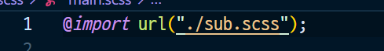

# SASS = SCSS

* CSS의 전처리 기능

* 스타일 적용 시, 태그 중첩을 하지 않아도 됨
* 주석 : /* */ , // 
* 상위 선택자 참조

`&` / 변수`$` / 산술연산 / 재활용`@mixin` - `@include` / 반복문 / 함수


변수

transform : translateX / X축으로 움직이는 효과


변수 `$` 를 써서 바꿈 (전역 변수, 지역 변수가 있음)


변수 주의 : 한번 할당하면, 바뀜


산술 연산

주의 : 나누기는 괄호안에서


예로 16:9 비율로 쓴다면!


* 재활용


* 반복문


* 반복문 > 보간법


* 반복문 > 보간법


* 함수 


* 16대 9비율로 한다면?


* 색상 내장함수


* 연결하기

한개, 두개 이상 연결




---

```
$ npm init -y
```

* package.json이 생김

``` 
$ npm i -D parcel-bundler
```


* package.json 변경 (7-8줄)


* scss를 쓰려면, css로 파싱해줌

index.html, main,scss


``` 
npm run dev
```

* dist 폴더에서 파싱해주는 것


---


